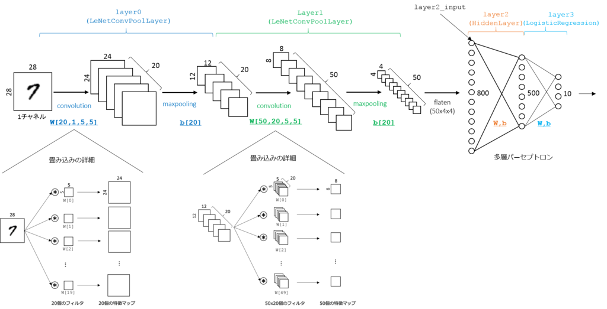

footer: © NTT Docomo, 2016
slidenumbers: true

# 第２回 AI勉強会

## 2016/02/01

### イノベーション統括部 古川 俊太

---

## アジェンダ

- 前回の復習
- 今回の話 : 畳み込みニューラルネットワーク
- 応用例

---

## 前回の復習

---

### Chainerを用いた Neural Network の基本

- 28x28の数字が書かれている画像を、数字として判断する。
  - モデルの作成
    - 784 -> 100 -> 100 -> 10 という４層を結合
    - 層の間は線形計算
    - 活性化関数を挟むことで、全体で非線形写像になる。
  - モデルの学習
    - データは学習用と検証用に分ける
    - モデルにデータを流し込み、正解ラベルとの差分を逆伝搬しパラメータの更新
    - 学習用データで学習仕切ったら、検証用のデータで精度の確認

---

## Model (モデル)

``` python
model = chainer.FunctionSet(l1=F.Linear(784, n_units),      
                            l2=F.Linear(n_units, n_units),  
                            l3=F.Linear(n_units, 10))       
```

---

## Forward Function (順伝搬関数)

``` python
def forward(x_data, y_data, train=True):
    x, t = chainer.Variable(x_data), chainer.Variable(y_data)
    h1 = F.dropout(F.relu(model.l1(x)), train=train)
    h2 = F.dropout(F.relu(model.l2(h1)), train=train)
    y = model.l3(h2)
```

---

## Optimizer (最適化機構)

``` python 

optimizer = optimizers.Adam()
optimizer.setup(model)

for epoch in range(1, n_epoch + 1):
    print "epoch: %d" % epoch

    perm = np.random.permutation(N)
    sum_loss = 0
    for i in range(0, N, batchsize):
        x_batch = xp.asarray(x_train[perm[i:i + batchsize]])
        y_batch = xp.asarray(y_train[perm[i:i + batchsize]])

        optimizer.zero_grads()
        loss = forward(x_batch, y_batch)
        loss.backward()
        optimizer.update()

        sum_loss += float(loss.data) * len(y_batch)

```

---

## 今回

## Convolutional Neural Network 

### [参考](http://aidiary.hatenablog.com/entry/20151007/1444223445)

---

## Convolutional Neural Network 

### 畳み込みニューラルネットワーク

- 画像認識によく用いられるネットワーク
- 主に２層からなっている
  - 畳み込み層
  - プーリング層
- 層の種類が変わるだけで、全体の学習ワークフローは同じ

--- 

## Convolution Layer 
### 畳み込み層

- 網膜のからの電気刺激を模したネットワーク
  - (nxn)のカーネルと呼ばれるものを元入力に掛け合わせる
    - 全結合でいうところのパラメータにあたる
  - （全結合よりも）隣接した入力要素の関連が情報として残る
    - この点が網膜と似ていると言われる所以

---

## Pooling Layer
### プーリング層

- 畳み込み層で得られた入力を、情報として際立たせる効果
  - (nxn)のカーネルで、以下のような処理を行う
    - マックスプーリング(最大値を抽出)
    - アベレージプーリング（平均値を抽出）
  - 活性化関数に近い役割

---

## MNISTへの適応



---

## Model (モデル)

``` python
model = chainer.FunctionSet(conv1=F.Convolution2D(1, 20, 5),   # 入力1枚、出力20枚、フィルタサイズ5ピクセル
                            conv2=F.Convolution2D(20, 50, 5),  # 入力20枚、出力50枚、フィルタサイズ5ピクセル
                            l1=F.Linear(800, 500),             # 入力800ユニット、出力500ユニット
                            l2=F.Linear(500, 10))              # 入力500ユニット、出力10ユニット   
```

---

## Forward Function (順伝搬関数)

``` python

def forward(x_data, y_data, train=True):
    x, t = chainer.Variable(x_data), chainer.Variable(y_data)
    h = F.max_pooling_2d(F.relu(model.conv1(x)), 2)
    h = F.max_pooling_2d(F.relu(model.conv2(h)), 2)
    h = F.dropout(F.relu(model.l1(h)), train=train)
    y = model.l2(h)

```

---

## Optimizer (最適化機構)

``` python 

optimizer = optimizers.Adam()
optimizer.setup(model)

for epoch in range(1, n_epoch + 1):
    print "epoch: %d" % epoch

    perm = np.random.permutation(N)
    sum_loss = 0
    for i in range(0, N, batchsize):
        x_batch = xp.asarray(X_train[perm[i:i + batchsize]])
        y_batch = xp.asarray(y_train[perm[i:i + batchsize]])

        optimizer.zero_grads()
        loss = forward(x_batch, y_batch)
        loss.backward()
        optimizer.update()
        sum_loss += float(loss.data) * len(y_batch)
```

---

## 応用例

---

### ILSVRC の歴史

```
- Imagenet 2011 winner (not CNN) 
  - 25.7%
- Imagenet 2012 winner 
  - 16.4% (Krizhesvky et al.)
- Imagenet 2013 winner 
  - 11.7% (Zeiler/Clarifai)
- Imagenet 2014 winner 
  - 6.7% (GoogLeNet)
```

---

## GoogLenet


---

## まとめ

- 全結合ニューラルネットの復習をした。
- 畳み込みニューラルネットワークの概要を説明した。